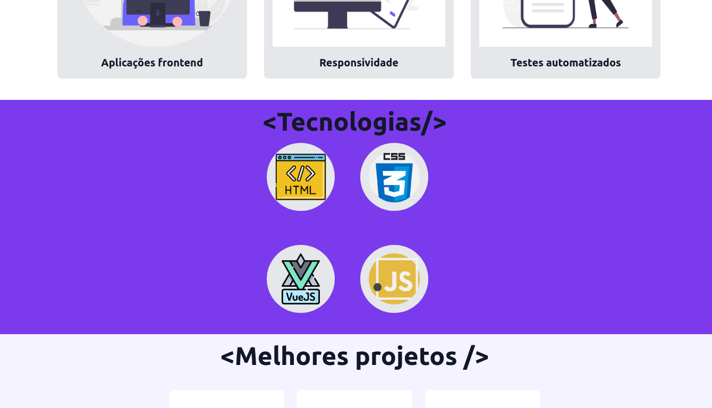
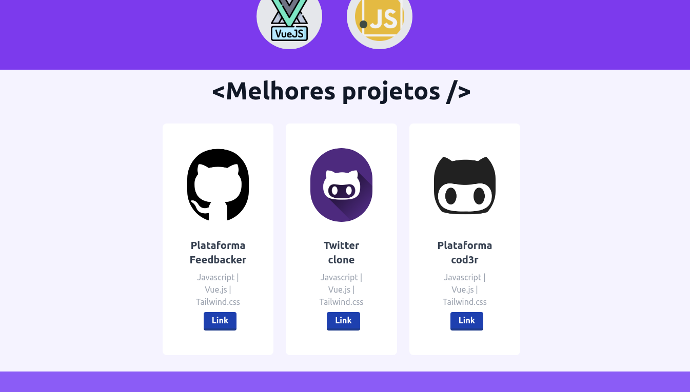
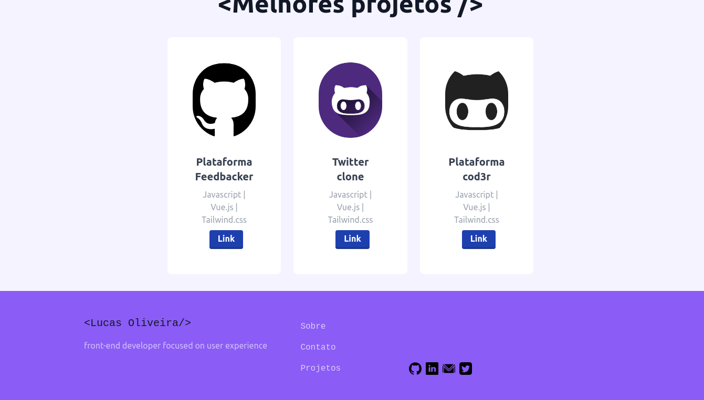

<p align="center">
</p>

<h1 align="center">
    
    
    
    
    
</h1>

<br>

## 🧪 Tecnologias

Esse projeto foi desenvolvido com as seguintes tecnologias:

- [Vuejs](https://vuejs.org/)
- [Tailwindcss](https://tailwindcss.com/)
- [Particles BG Vue](https://madewithvuejs.com/particles-bg-vue/)

## 🔖 Layout
Layout inspirado em modelos de spa.

Feito com 💜 by Lucas Oliveira 👋🏻


# portfolio

## Project setup
```
npm install
```

### Compiles and hot-reloads for development
```
npm run serve
```

### Compiles and minifies for production
```
npm run build
```

### Lints and fixes files
```
npm run lint
```

### Customize configuration
See [Configuration Reference](https://cli.vuejs.org/config/).
